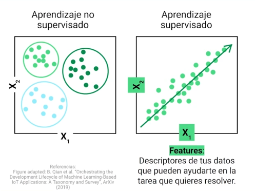
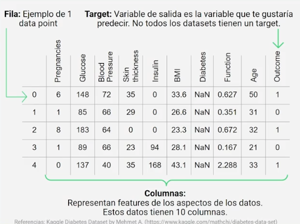
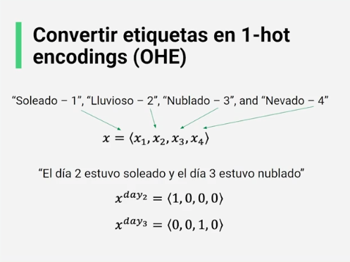
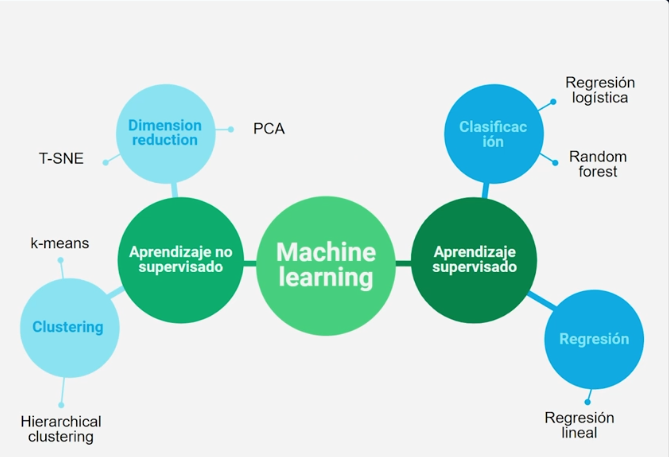
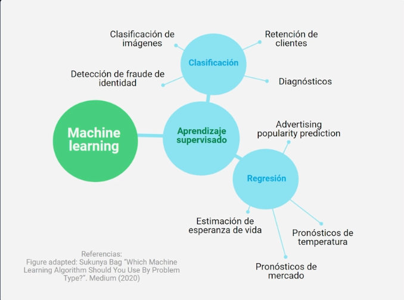
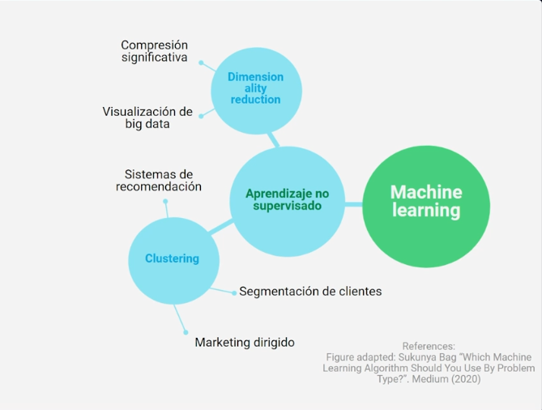

# Introducción al Machine Learning


# Tabla de Contenido
- [Introducción al machine learning](#introducción-a-machine-learning)
    - [¿Qué es machine learning?](#qué-es-machine-learning)
    - [Framework de ciencias de datos](#framework-de-ciencia-de-datos)
        - [Convertir datos categóricos en etiquetas](#convertir-datos-categóricos-en-etiquetas)
    - [Pandas](#pandas)
    - [Visualización](#visualización-de-los-datos)
    - [Tipos de modelos de machine learning](#tipos-de-modelos-de-machine-learning)
- [Algoritmos simples de machine learning](#algoritmos-simples-de-machine-learning)
- [Deep Learning](#deep-learning)
- [Conclusiones](#conclusiones)

# Introducción a machine learning

## ¿Qué es machine learning?

> Machine learning es la ciencia de usar algoritmos para identificar patrones en datos con el fin de resolver un problema de interés.

- Aprendizaje supervisado: Tengo unas salidas que me ayudan a entrenar el algoritmo.
- Aprendizaje no supervisado: En este caso no tengo salidas para entrenar el algoritmo, solo nos queda extraer información de los datos dados.



## Framework de ciencia de datos

**Terminología para ciencia de datos**
- **Data/Datos**: unidades de información o "hechos" de observaciones.
- **Features**: tipos de información acerca de tus observaciones.
- **Filas**: observaciones individuales o muestras.
- **Columns**: features que describen tus observaciones.
- **Outlier**: punto(s) de datos o data point(s) que se comporta de forma extraña.
- **Pre-processing**: preparar datos para su uso en un modelo de machine learning.
- **ETL pipeline**: framework de data science para extraer, transformar y cargar.

**Dataset**



**Tipos de datos**
- **Numéricos**: su feature es un número de tipo entero o flotante.
- **Categórica**: sus features representan una clase o tipo; usualmente se representan como un mapa de números o un "one-hot" vector.
- **Image**: su feature representa una imagen.
- **Texto**: su feature es en forma de texto, sea corto (como Twitter) o largo (como en noticias).
- **Nan**: su feature es desconocido o perdido.

### Convertir datos categóricos en etiquetas

Se le asigna a cada tipo de etiqueta un valor númerico. O la otra alternativa es la siguiente:


Es decir, se construye un vector con todas las etiquetas y se le asigna el valor 1 a la etiqueta correspondiente para ese ejemplo y al resto se le asigna el valor 0.

## Pandas

```python
# Read in your CSV
data = pd.read_csv("file.csv")

# Get a sneak preview of the dataset
data.head()
# Muestra las primeras 5 filas

"""
Muestra el tipo de representación
de los datos
"""
data.dtypes
```

## Visualización de los datos
**Tipos**:
- Histogramas: Te dice qué tan *frecuentes* son ciertos valores en tus datos. Requiere *agrupar* los datos.
- Scatter Plots: Muestra la relación entre 2 features graficándolas como pares ordenados. Ayuda a detectar anomalías. 

## Tipos de modelos de machine learning

**Algoritmos de Machine Learning**:
- Aprendizaje no supervisado: Objetivo desconocido, queremos encontrar estructuras y grupos dentro de los datos.
    - **Clustering**: Queremos encontrar grupos en los datos.
    - **Dimensionality reduction**: Queremos encontrar qué features de entrada en los datos son de ayuda.
- Aprendizaje supervisado: El modelo obtiene features de entrada y salida. Hay un target/objetivo a predecir.
    - **Regresión**: target output (objetivo de salida) es numérico.
    - **Clasificación**: target output es una etiqueta.



### Ejemplos de problemas para tratar con algoritmos de machine learning.



## Reto

Dataset: 
- Pregnancies: Number of times pregnant
- Glucose: Plasma glucose concentration a 2 hours in an oral glucose tolerance test
- BloodPressure: Diastolic blood pressure (mm Hg)
- SkinThickness: Triceps skin fold thickness (mm)
- Insulin: 2-Hour serum insulin (mu U/ml)
- BMI: Body mass index (weight in kg/(height in m)^2)
- DiabetesPedigreeFunction: Diabetes pedigree function
- Age: Age (years)
- Outcome: Class variable (0 or 1)

> [Solución al reto en notebook](src/reto_procesando_un_dataset.ipynb)

# Algoritmos simples de machine learning

# Deep Learning

# Conclusiones