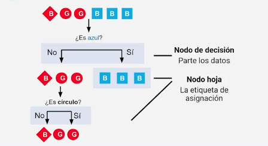
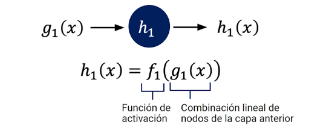

# Introducción al Machine Learning


# Tabla de Contenido
- [Introducción al machine learning](#introducción-a-machine-learning)
    - [¿Qué es machine learning?](#qué-es-machine-learning)
    - [Framework de ciencias de datos](#framework-de-ciencia-de-datos)
        - [Convertir datos categóricos en etiquetas](#convertir-datos-categóricos-en-etiquetas)
    - [Pandas](#pandas)
    - [Visualización](#visualización-de-los-datos)
    - [Tipos de modelos de machine learning](#tipos-de-modelos-de-machine-learning)
    - [Reto](#reto-section-1)
- [Algoritmos simples de machine learning](#algoritmos-simples-de-machine-learning)
    - [Normalizar tus datos númericos](#normalizar-tus-datos-númericos)
    - [Preparar los datos para modelos](#preparar-los-datos-para-modelos)
    - [Linear Regression](#linear-regression)
    - [Logistic Regression](#logistic-regression)
    - [Random forest classifier](#random-forest-classifier)
    - [K-means](#algoritmos-no-supervisados)
    - [Reto](#reto-section-2)
- [Deep Learning](#deep-learning)
    - [Mejorar las predicciones de las redes neuronales](#mejorar-las-predicciones-de-las-redes-neuronales)
    - [Entrenamiento de Redes Neuronales](#entrenamiento-de-redes-neuronales)
        - [Ejemplo de entrenamiento de la NN](#ejemplo-de-entrenamiento-de-la-nn)
- [Conclusiones](#conclusiones)

# Introducción a machine learning

## ¿Qué es machine learning?

> Machine learning es la ciencia de usar algoritmos para identificar patrones en datos con el fin de resolver un problema de interés.

- Aprendizaje supervisado: Tengo unas salidas que me ayudan a entrenar el algoritmo.
- Aprendizaje no supervisado: En este caso no tengo salidas para entrenar el algoritmo, solo nos queda extraer información de los datos dados.


## Framework de ciencia de datos

**Terminología para ciencia de datos**
- **Data/Datos**: unidades de información o "hechos" de observaciones.
- **Features**: tipos de información acerca de tus observaciones.
- **Filas**: observaciones individuales o muestras.
- **Columns**: features que describen tus observaciones.
- **Outlier**: punto(s) de datos o data point(s) que se comporta de forma extraña.
- **Pre-processing**: preparar datos para su uso en un modelo de machine learning.
- **ETL pipeline**: framework de data science para extraer, transformar y cargar.

**Dataset**


**Tipos de datos**
- **Numéricos**: su feature es un número de tipo entero o flotante.
- **Categórica**: sus features representan una clase o tipo; usualmente se representan como un mapa de números o un "one-hot" vector.
- **Image**: su feature representa una imagen.
- **Texto**: su feature es en forma de texto, sea corto (como Twitter) o largo (como en noticias).
- **Nan**: su feature es desconocido o perdido.

### Convertir datos categóricos en etiquetas

Se le asigna a cada tipo de etiqueta un valor númerico. O la otra alternativa es la siguiente:


Es decir, se construye un vector con todas las etiquetas y se le asigna el valor 1 a la etiqueta correspondiente para ese ejemplo y al resto se le asigna el valor 0.

## Pandas

```python
# Read in your CSV
data = pd.read_csv("file.csv")

# Get a sneak preview of the dataset
data.head()
# Muestra las primeras 5 filas

"""
Muestra el tipo de representación
de los datos
"""
data.dtypes
```

## Visualización de los datos
**Tipos**:
- Histogramas: Te dice qué tan *frecuentes* son ciertos valores en tus datos. Requiere *agrupar* los datos.
- Scatter Plots: Muestra la relación entre 2 features graficándolas como pares ordenados. Ayuda a detectar anomalías. 

## Tipos de modelos de machine learning

**Algoritmos de Machine Learning**:
- Aprendizaje no supervisado: Objetivo desconocido, queremos encontrar estructuras y grupos dentro de los datos.
    - **Clustering**: Queremos encontrar grupos en los datos.
    - **Dimensionality reduction**: Queremos encontrar qué features de entrada en los datos son de ayuda.
- Aprendizaje supervisado: El modelo obtiene features de entrada y salida. Hay un target/objetivo a predecir.
    - **Regresión**: target output (objetivo de salida) es numérico.
    - **Clasificación**: target output es una etiqueta.


### Ejemplos de problemas para tratar con algoritmos de machine learning.


## Reto Section 1

Dataset: 
- Pregnancies: Number of times pregnant
- Glucose: Plasma glucose concentration a 2 hours in an oral glucose tolerance test
- BloodPressure: Diastolic blood pressure (mm Hg)
- SkinThickness: Triceps skin fold thickness (mm)
- Insulin: 2-Hour serum insulin (mu U/ml)
- BMI: Body mass index (weight in kg/(height in m)^2)
- DiabetesPedigreeFunction: Diabetes pedigree function
- Age: Age (years)
- Outcome: Class variable (0 or 1)

> [Solución al reto en notebook](src/reto_procesando_un_dataset.ipynb)

> Tips del reto:
> - Elimina cualquier valor faltante y remplazarlos hacia la variable de los datos `data = data.dropna()`.

> Plotting Multiple Graphs
> ```python
>f = plt.figure(figsize=(20,10))
>for index, val_bins in enumerate([20, 25, 30, 35, 40, 85]):
>    ax = f.add_subplot(2,3,index+1)
>    data["Age"].hist(ax=ax, edgecolor='black', linewidth=2, bins=val_bins, color=plt.cm.tab20(index))
>    ax.set_title("Age range of patients")
>    ax.set_ylim([0, 510])
>    ax.set_xlabel("Age")
>    ax.set_ylabel("Count")
>f.tight_layout()
>```

# Algoritmos simples de machine learning

**Receta de algoritmos ML**
1. **Proceso de decisión**: cómo los modelos hacen una predicción, o retornan una respuesta, usando los parámetros.
2. **Función de error/coste**: cómo evaluar si los parámetros en el modelo generan buenas predicciones.
3. **Regla de actualización**: cómo mejorar los parámetros para hacer mejores predicciones (usando optimización numérica).

## Normalizar tus datos númericos

Para cada columna del dataset con valores numéricos:
1. Calcular el promedio de tus datos ($\mu$).
2. Calcular la desviación estándar ($\sigma$) de los datos.
3. Calcular: $$\hat{x}_i = \frac{x_i-\mu}{\sigma}$$

## Preparar los datos para modelos

Dividir el conjunto de datos en: 
- Training(60-80%) datos de los que el modelo aprende patrones.
- Validation(0-20%) datos para verificar que el modelo aprende.
- Testing(0-20%) datos que se apartan para revisar si el modelo fue exitoso al predecir.

## Linear Regression


> Parámetros: Diferentes parámetros cambian lo que pensamos de la relación entre features ($x$) y target ($y_{pred}$). 
> $y_{pred}= w_1\cdot x + w_0$
> donde $W_1$ un cambio en $x$ resulta un cambio en $y$, y $W_0$ el valor de $y$ si $x$ es 0.

**Función de costo**: El costo $\epsilon$ es la diferencia entre el valor del target $y_i$ y el valor predecido de nuestra línea $y_{pred}$.
$$\mathcal{J}(w, w_0)=\frac{1}{N}\sum_{i=0}^{N}(y_i - y_{i, pred}^2)$$

**Update Rule**:  Queremos minimizar la distancia $y_{i_pred}$ sobre cada punto de datos en entrenamiento. Cambiamos $w_0$ y $w_1$ hasta encontrar una suma de distancia menor. $\text{Update Rule} = \min \mathcal{J}(w_0, w_1)$

**Metric**: MSE and R^2 ayudan a identificar la fortaleza de la relación entre features de entrada y de salida.


## Logistic Regression

**A diferencia de la regresión lineal que predice una salida numérica, la regresión logística predice una clase/etiqueta.**


El anterior es un ejemplo donde queremos clasificar la relación entre aprobar y las horas de sueño. Es decir, dado un estudiante que duerme $x$ horas deseamos saber la probabilidad de aprobar o no.

$$p_\text{pass} = \frac{\exp(w_0 + w_1\cdot x_1)}{1+\exp(w_0 + w_1\cdot x_1)}$$
$$\mathcal{J}(w, w_0)=-\frac{1}{N}\sum_{i=0}^{N} y_i\cdot \log(p_\text{pass}) + (1-y_{i, pred}) \cdot \log(1-p_\text{pass})$$

> Explicación por términos:

> $y_i\cdot \log(p_\text{pass})$ -> Si el estudiante ha pasado el examen, no es 0 este término.
>
> $(1-y_{i, pred}) \cdot \log(1-p_\text{pass})$ -> Si el estudiante **no ha pasado** es no pasando. Este término no es 0.

> Empleamos el mismo criterio para actualizar, minimizado la función de costo.


De esta matriz de confusión podemos obtener: $$\text{Accuracy}=\frac{(TP + TN)}{(TP+TN+FP+FN)} = \frac{\text{number correctly labeled}}{\text{number of data points}}$$

## Random Forest classifier


Un random forest es un conjunto o un grupo de decisiones que "votan" oir la respuesta correcta. Creando varios árboles se pueden generar diferentes preguntas que hacer a los datos. Luego se realiza una votación con el objetivo de seleccionar los resultados ligados a esos árboles, que por ende hicieron las mejores preguntas.

**Parámetros**:
- **Número de árboles**: Más árboles, menor la variación, más cómputo.
- **Max features**: El número de features usados para partir (split).
- **Max depth**: El número de niveles del árbol de decisión. (Preguntas)
- **$N_{split}$ = Min samples split**: Número de data points que un nodo debe tener antes de dividirse.
- **$n$ = Min samples leaf**: El mínimo número de muestras requeridas para estar en una hoja (leaf).


**Árboles de decisión: función de coste y regla de actualización**
- **Función de coste**: para un feature seleccionado, encuentra el mejor split-point (punto de separación) y separa los datos en dos nodos más pequeños.
- **Regla de actualización**: Si el nodo hoja tiene más de $n_{min}$ puntos de datos, repite la función de coste, sino para.

**Árboles de decisión: rendimiento**
- Se pueden usar métricas de clasificación o regresión para evaluar qué tan bueno es el modelo.

**Repaso: ingredientes de árbol de decisión**
- **Proceso de decisión**: De un subset de features aleatorios de tus datos, elige un feature. Divide tus datos.
- **Función de error/coste**: Usando Gini y criterio de entropía para encontrar el mejor umbral para dividir tus datos.
- **Regla de actualización**: Si los nodos hoja no tienen \( n_m \) puntos de datos, repite el proceso.

## Algoritmos no supervisados


**K-Means**:
1. Colocar los centroides aleatoriamente. Partiendo de un valor $K$. Se puede extrapolar de los datos o intuición.
2. Calcular la distancia entre los puntos y los centroides. 
3. Asignar a los centroides aquellos puntos más cercanos a ellos.
4. Luego mover los centroides al valor medio de las posiciones de todos los puntos.
5. Repetir los pasos anteriores hasta un criterio, normalmente hasta que los puntos no cambien de centroide. 

$$\mathcal{J}(c^1, \dots, c^n)=\sum_{j=1}^K\sum_{x \in S_j} |x_i^j-c^j|^2$$


**Rendimiento:**
- Inertia: qué tan cerca esrán los puntos de datos al centroide. Este número debe ser pequeño.
- Silhouette score: qué tan lejanos son los cluster, de $[-1, 1]$. Este número debe ser cercano a 1.
- 

## Reto Section 2

**Dataset**: Inspeccionando los elementos parece que los "datos" contienen la información que necesitamos. Están en la forma de array, típicamente denotado $N \times M$ donde $N$ representa el número de filas (150), y $M$ el número de columnas (4).

La clave `feature_names` indica la información de las características: largo del sépalo, ancho del sépalo, largo del pétalo y ancho del pétalo.

El término "target", salida u objetivo es típicamente la meta que queremos modelar. La clave `target_names` indica 3 especies de esta flor: "setosa", "versicolor" y "virginica".

The term "target" is typically the goal we are trying to model. The key "target_names" indicates 3 species of this flower, "setosa", "versicolor", and "virginica".

Nuestra meta es usar estos features y descripciones de las flores para poder predecir la especie de la planta.

### Truco

Si no conocemos las etiquetas, contrario al caso del reto, podemos emplear la Curva de Elbow:
```python
I = []
centroids = []
for c in range(2,11):
  k2model = KMeans(n_clusters=c, random_state=42)
  k2model.fit(data[["petal length (cm)", "petal width (cm)"]])
  I.append(k2model.inertia_)
  centroids.append(k2model.cluster_centers_)

f = plt.figure(figsize=(7,5))
ax = f.add_subplot(1,1,1)

ax.scatter(x=np.arange(2,11), y=I)
ax.plot(np.arange(2,11),I)

ax.set_xlabel('Clusters')
ax.set_ylabel('Inertia')
ax.set_title('Elbow method for optimal k value')

f.tight_layout()
```


> **Nota**: código aportado por la comunidad de estudiantes de Platzi (Jonathan Vásquez Alvarado)

> También se puede usar la biblioteca: https://www.scikit-yb.org/en/latest/index.html

# Deep Learning

> Red Neuronal: es un modelo que usa neuronas y conexiones entre ellos para hacer predicciones. **Son usadas usualmente para aprendizaje supervisado.**
> 

**Capa de entrada conecta con múltiples unidades ocultas**
- Cada unidad oculta recibe una combinación lineal de todas las entradas.
- Para la misma entrada existen diferentes pesos dependiendo de cuál unidad oculta esté adjunta. Estos pesos pueden ser distintos.
- **Ejemplo**: $W_{2,3}$ El peso de la segunda entrada a la tercera unidad.

**La unidad oculta ejecuta una función en la combinación lineal $g_1(x)$. Esta es la llamada función de activación. 


**Tipos de función de activación:**
- Lineal: $f(x)=x$
- ReLU: $f(x) = x \quad\forall~x \ge 0 ~\text{else} f(x)=0  \quad\forall~x \le 0$
- Sigmoid: $f(x)=1/(1+\exp(-x))$
- Tanh: $f(x)=\tanh(x)$
- Se deben evitar la linealidad para funciones complejas.

**Capa de salida**: Existen diferentes funciones de activación para clasificación o regresión para esta capa. Algunas funciones de activación tienen *rango limitado** (ex: softmax/sigmoide), mientras que otras se **extienden indefinidamente** (ReLUs, lineal).


**Añadiendo capas**: Cuando hablamos de **profundidad** es agregar más capas al model. Mientra que cuando hablamos de **ancho** es agregar más unidades ocultas o neuronas.

## Mejorar las predicciones de las redes neuronales


- Con el **Dropout** podemos evitar el sobreajuste, esta técnica *ignora* aleatoriamente algunos nodos (neuronas) mientras entrena. Evita que el modelo retenga toda la información y en vez de aprender a generalizar solo memoriza. Esto siempre se quiere evitar.

- Debemos preveer el overfitting 


- Observamos en la figura anterior como empleamos los datos de validación para controlar el entrenamiento de la red neuronal y de esta forma evitamos el overfitting, nos detenemos en el número óptimo de épocas.

- Las redes neuronales tienen tres capas generales: Entrada, Ocultas y Salida.

- **Funciones de activación** para capas ocultas y de salida.

- Entrenamiento involucra avanzar en la red, calcular la pérdida y backpropagation.

- El aprendizaje y dropout son importantes para el entrenamiento.

- Evalúa la pérdida y el rendimiento en el set de validación.

## Entrenamiento de Redes Neuronales

1. Escoge tu arquitectura.
2. La *receta* de entrenamiento.
3. Ajustar tu tasa de entrenamiento.


- DNN: Usada en muchos problemas complejos. Emplea casi todas las funciones de activación vista.
- CNN: Usada en imágenes y genómicos. Operador convoluciona/pool y kernels como herramienta matemática para extraer información de los datos.
- RRN: Representa secuencias, usada en lenguaje. Emplea celdas de memoria/puerta como herramienta matemática para su funcionamiento.

### Ejemplo de entrenamiento de la NN


> Backpropagation: método para ajustar los pesos de las neuronas de la red neuronal.

## Etapas del entrenamiento

- Feed forward: avance hacia adelante


- Como función de pérdida en regresión podemos emplear MSE $$J = \frac{1}{N}\sum_{i=1}^{N}(y_i-y_{i, pred})^2$$

- Como función de pérdida en regresión podemos emplear Binary Cross-Entropy (BCE) $$J = -\frac{1}{N}\sum_{i=0}^{N} y_i\cdot \log(p_\text{Class 1}) + (1-y_{i}) \cdot \log(1-p_\text{Class 1})$$

- Además para el caso de la clasificación de múltiples categorías tenemos Categorical Cross-Entropy (CCE) $$J=\sum_{i=1}^C - t_i \log(p_i)$$, donde $C$ es el número de clases, $t_i$ la etiqueta correcta y $p_i$ es la probabilidad de predección de la clase.

- Backpropagation: s la regla de actualización usada para ajustar los pesos en redes neuronales. Actualizamos cada peso en la red tomando la derivada (parcial) de ello con respecto a cada nodo, empezando desde la salida hasta las entradas.


- **Analogía de la tasa de aprendizaje**: La optimización se usa para encontrar pesos de acuerdo a las reglas de actualización. 
    - Si la tasa de aprendizaje (learning rate) es **muy pequeña**, toma mucho tiempo encontrar buenos pesos.
    - Si es **muy grande**, el modelo podría atorarse en una mala solución.

# Conclusiones

**Qué aprendimos**
- Bases de ciencia de datos y visualizaciones.
- Algoritmos de aprendizaje supervisado.
- Algoritmos de aprendizaje no supervisado.
- Redes neuronales y deep learning.

**Qué más aprender**
- Uso práctico y avanzado de algoritmos de machine learning y redes neuronales.
- Uso avanzado de **librerías ML** como scikit-learn y TensorFlow.
- Despliegue de aplicaciones de ML.
- Procesamiento de lenguaje natural y más.